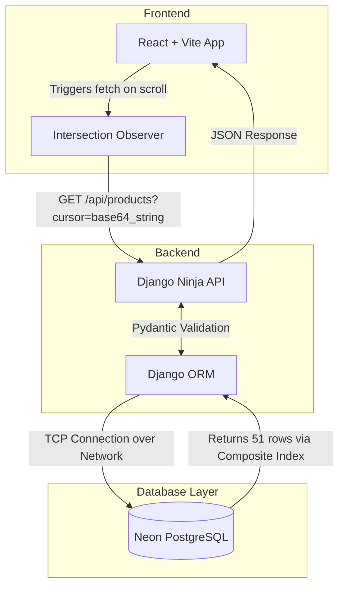
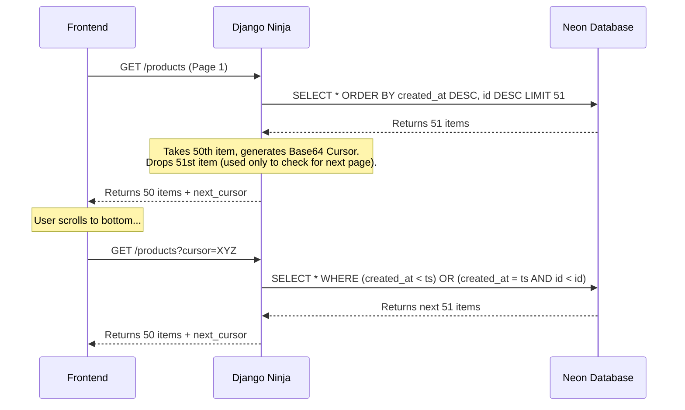

# CodeVector Internship Task: High-Performance Products API

This repository contains the solution for the CodeVector take-home backend task. It demonstrates the ability to build a highly optimized, fast, and robust backend capable of handling 200,000+ records, paired with a modern React frontend.

## 🚀 Key Features

- **Cursor-Based Pagination:** Solves the core requirement of showing correct data while the database is actively changing. Ensures zero duplicate items and zero skipped items, even if hundreds of products are inserted concurrently.
- **High-Speed Data Seeding:** Bypasses the N+1 problem and slow loops by utilizing ORM `bulk_create` to insert 200,000 products over the network in under 60 seconds.
- **Optimized Indexing:** Uses a composite database index `['created_at', 'id']` to allow the PostgreSQL engine to instantly seek to the exact page location.
- **Modern UI:** A visually stunning React frontend with Framer Motion animations, infinite scrolling, and floating navigation.

---

## 🏗️ System Architecture



## 🧠 Core Engineering Decisions

### 1. Cursor Pagination vs Offset Pagination

Traditional Offset Pagination (`OFFSET 100 LIMIT 50`) is slow on large tables because the database must scan and count rows before discarding them. Worse, if new items are inserted at the top of the list while a user is browsing, the entire list shifts downward, causing the user to see the same products twice on the next page.

**The Solution:** Cursor Pagination.
We encode the `created_at` timestamp and the unique `id` of the *last item* seen into a Base64 cursor. 



### 2. Fast Data Seeding (Network Optimization)

Instead of making 200,000 individual database calls (which would suffer massive network latency overhead), the `seed_products.py` script batches objects into memory.

```python
if len(products_to_create) == 10000:
    Product.objects.bulk_create(products_to_create)
```
This translates 10,000 Python objects into a single, massive SQL `INSERT` statement sent over the internet in a **single network trip**.

---

## 💻 Tech Stack

- **Backend:** Python, Django, Django Ninja (API Layer), psycopg2
- **Database:** PostgreSQL (Hosted on Neon.tech)
- **Frontend:** React, Vite, Tailwind CSS v4, Framer Motion, Lucide React

## 🛠️ Running Locally

### Prerequisites
- Node.js
- Python 3.10+

### Backend Setup
1. Navigate to the backend directory: `cd backend`
2. Create a virtual environment: `python -m venv venv`
3. Activate it: `.\venv\Scripts\activate` (Windows) or `source venv/bin/activate` (Mac/Linux)
4. Install dependencies: `pip install -r requirements.txt` *(Make sure to freeze them if you haven't!)*
5. Configure `.env` with your Neon `DATABASE_URL`.
6. Run the server: `python manage.py runserver`

### Frontend Setup
1. Navigate to the frontend directory: `cd frontend`
2. Install dependencies: `npm install`
3. Start the dev server: `npm run dev`
4. Open `http://localhost:5173` in your browser.
